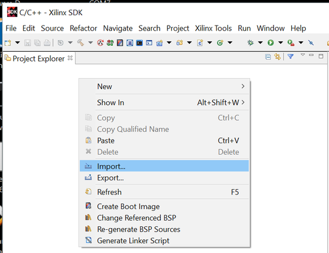
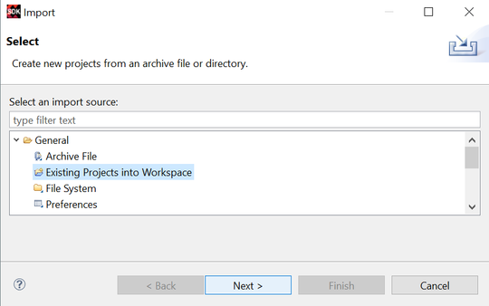
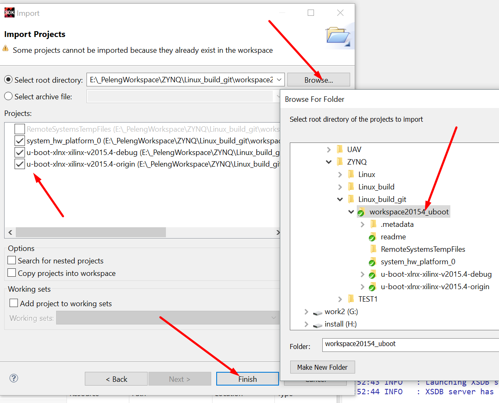
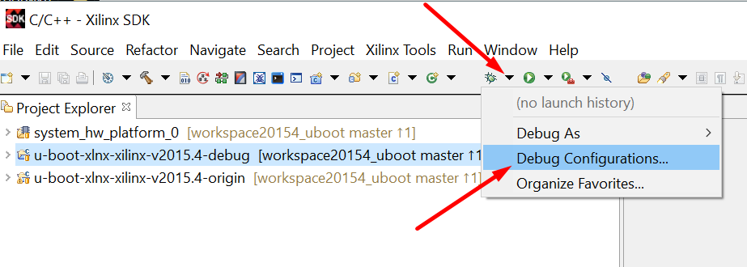
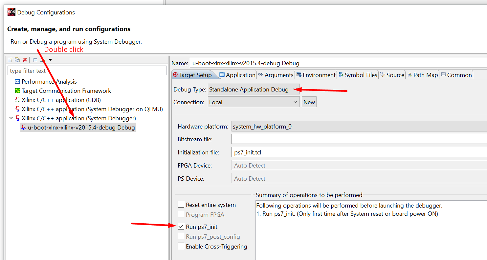
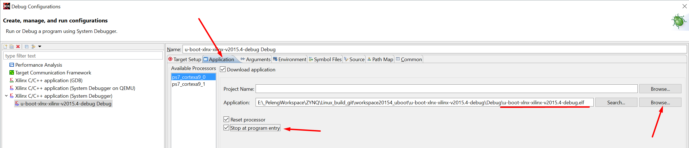

# Xilinx U-boot 2015.4 Zynq (Windows Xilinx SDK) 

Ready to use project U-boot with Xilinx SDK. Main goal is build and debug U-boot with IDE in bare metal. 

## Getting Started

This repository contains a full working work space for an easy start working with it. U-boot has been tested by downloading the image Linux  over the network and via a memory SD card. 

 -[u-boot-xlnx](https://github.com/Xilinx/u-boot-xlnx) - Official Xilinx repositories U-boot

 -[xilinx-v2015.4](https://github.com/Xilinx/u-boot-xlnx) - Source code U-boot xilinx-v2015.4


### Prerequisites

- Windows 10
- Xilinx SDK 2015.4 (or 2015.3)
- ZedBoard 

### Set up workspace

- clone 
- open as workspace with Xilinx SDK 
- import projects 

**Set off Build Automatically**

```
Menu: Project -> Build Automatically off
```


### Import projects

```
right click on Project Explorer -> Import -> Existings Project Into Workspace -> Browse -> Finish
```







### Build

 Workspace consists of three projects.

- system_hw_platform_0 - hardware platform for Zynq 7020 ZedBoard DevKit.
- u-boot-xlnx-xilinx-v2015.4-origin - origin source code (build but not work, not debug yet)
- u-boot-xlnx-xilinx-v2015.4-debug - modify source code (build and debug, work correct)


Before building a project, you need to change the absolute paths in two places. These paths depend on where you have your SDK installed and maybe different than mine.

We can do this through the project properties.

```
right click on u-boot-xlnx-xilinx-v2015.4-debug (origin) -> Properties -> C/C++ Build -> Settings -> Derictories
 ```

```
right click on u-boot-xlnx-xilinx-v2015.4-debug (origin) -> Properties -> C/C++ Build -> Settings -> Software Platform
```


Build Project. A file  **u-boot-xlnx-xilinx-v2015.4-debug.elf** will appear in the folder **Debug**

```
right click on u-boot-xlnx-xilinx-v2015.4-debug (origin) -> Build Project
```

If everything is successful you will see the following:

    'Invoking: ARM Linux Print Size'
    arm-xilinx-linux-gnueabi-size u-boot-xlnx-xilinx-v2015.4-debug.elf  |tee "u-boot-xlnx-xilinx-v2015.4-debug.elf.size"
    text	   data	    bss	    dec	    hex	filename
    842656	  33792	 881088	1757536	 1ad160	u-boot-xlnx-xilinx-v2015.4-debug.elf
    'Finished building: u-boot-xlnx-xilinx-v2015.4-debug.elf.size'

### Debug

Work only with u-boot-xlnx-xilinx-v2015.4-debug project!


- connect ZedBoard (jtag + uart)
- remove SD card
- set jampers  MIO6-GND, MIO5-3.3, MIO4-3.3, MIO3-GND, MIO2-GND    
- open **Debug Configuration** create New Xilinx C/C++ application (System Debugger)
- set correct path to **u-boot-xlnx-xilinx-v2015.4-debug.elf** file
- apply
- run debug








### Working 

Explore the project comfortably with breakpoints!


